## การติดตั้ง HAPI FHIR Server สำหรับการจัดเก็บข้อมูลของโรงพยาบาล

### ความต้องการขั้นต่ำของเครื่องเซิร์ฟเวอร์

1.  หน่วยประมวลผลกลาง 2 หน่วยขึ้นไป (CPU ที่มี 2 Cores ขึ้นไป)
2.  หน่วยความจำของคอมพิวเตอร์ 4 GB ขึ้นไป (RAM ที่มีขนาด 4 GB ขึ้นไป)
3.  พื้นที่จัดเก็บข้อมูล 20 GB ขึ้นไป
4.  ระบบปฏิบัติการแบบ Linux (Ubuntu เวอร์ชั่น 18.04 ขึ้นไป)

### ขั้นตอนการติดตั้งโปรแกรมสำหรับเครื่องเซิร์ฟเวอร์

#### ติดตั้ง Docker Engine

1. อัปเดต package index และติดตั้ง package ที่ต้องใช้

```bash
sudo apt-get update
sudo apt-get install ca-certificates curl gnupg lsb-release
```

2. เพิ่ม Docker GPG key

```bash
curl -fsSL https://download.docker.com/linux/ubuntu/gpg \
  | sudo gpg --dearmor -o /usr/share/keyrings/docker-archive-keyring.gpg
```

3. เพิ่ม Docker repository

```bash
echo "deb [arch=$(dpkg --print-architecture) signed-by=/usr/share/keyrings/docker-archive-keyring.gpg] https://download.docker.com/linux/ubuntu $(lsb_release -cs) stable" \
  | sudo tee /etc/apt/sources.list.d/docker.list > /dev/null
```

4. ติดตั้ง Docker Engine แล้วทดสอบด้วย `hello-world`

```bash
sudo apt-get update
sudo apt-get install docker-ce docker-ce-cli containerd.io
sudo docker run hello-world
```

(อ้างอิง [https://docs.docker.com/engine/install/ubuntu/](https://docs.docker.com/engine/install/ubuntu/))

#### ติดตั้ง Docker Compose

1. ดาวน์โหลด Docker Compose 1.29.2 ตามเวอร์ชันที่ Community Edition ใช้

```bash
sudo curl -L \
  "https://github.com/docker/compose/releases/download/1.29.2/docker-compose-$(uname -s)-$(uname -m)" \
  -o /usr/local/bin/docker-compose
```

2. กำหนดสิทธิ์และตรวจสอบเวอร์ชัน

```bash
sudo chmod +x /usr/local/bin/docker-compose
docker-compose --version
```

(อ้างอิง [https://docs.docker.com/compose/install/](https://docs.docker.com/compose/install/))

#### ติดตั้ง HAPI FHIR Server

1. Clone source code จาก GitHub:
    [https://github.com/health-tag/hospital-fhir-node](https://github.com/health-tag/hospital-fhir-node)

2. สร้างไฟล์ `.pgenv` สำหรับฐานข้อมูล Kong โดยเปลี่ยน placeholder ก่อนใช้งาน

```dotenv
POSTGRES_DB=kong
POSTGRES_USER=kong
POSTGRES_PASSWORD=<CHANGE_ME_KONG_DB>
```

3. สร้างไฟล์ `.kongenv` และใช้รหัสผ่านเดียวกับ `POSTGRES_PASSWORD`

```dotenv
KONG_PROXY_ACCESS_LOG=/dev/stdout
KONG_ADMIN_ACCESS_LOG=/dev/stdout
KONG_PROXY_ERROR_LOG=/dev/stderr
KONG_ADMIN_ERROR_LOG=/dev/stderr
KONG_ADMIN_LISTEN=0.0.0.0:8001, 0.0.0.0:8444 ssl
KONG_DATABASE=postgres
KONG_PG_HOST=db
KONG_PG_DATABASE=kong
KONG_PG_USER=kong
KONG_PG_PASSWORD=<CHANGE_ME_KONG_DB>
```

4. สร้างไฟล์ `.hapimysqlenv` สำหรับฐานข้อมูล HAPI

```dotenv
MYSQL_DATABASE=ha1pi
MYSQL_USER=<CHANGE_ME_HAPI_DB_USER>
MYSQL_PASSWORD=<CHANGE_ME_HAPI_DB_PASSWORD>
MYSQL_ROOT_PASSWORD=<CHANGE_ME_HAPI_ROOT_PASSWORD>
```

5. Build และเปิด container

```bash
docker-compose up --build -d
docker ps
```

6. ตรวจสอบ service ภายในเครือข่ายที่กำหนด

- Konga: `http://ip_address:1337`
- HAPI UI: `http://ip_address:8080`
- CSOP upload: `http://ip_address:8888`

#### ตั้งค่ารหัสสำหรับการเข้าหน้าอัพโหลดไฟล์ CSOP เข้าสู่ระบบ

เข้าสู่ระบบด้วย url http://ip_address:8888 จะแสดงหน้า Login ให้ใส่ Username ว่า
admin และ password ว่า admin เช่นเดียวกัน เมื่อเข้าสู่ระบบได้แล้วให้เลือกเมนู Settings

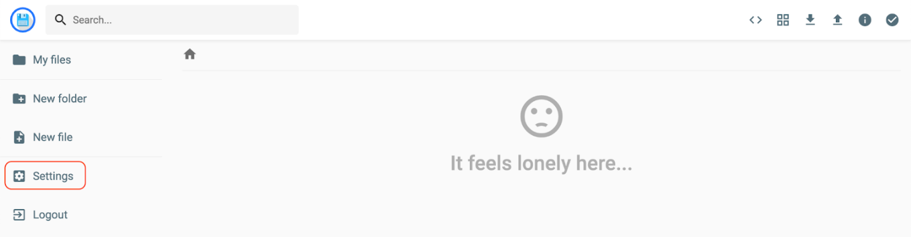

<small class="manual-caption">หน้าจอแสดงภาพรวมระบบ</small>

ให้ทำการเปลี่ยนรหัสผ่านของ admin ใหม่และกด Update

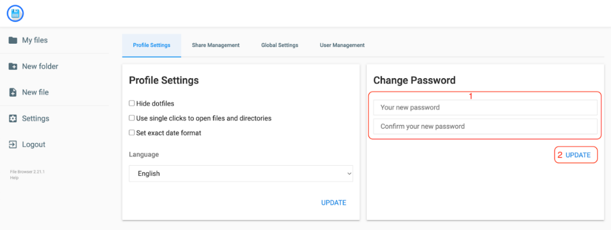

<small class="manual-caption">หน้าจอแสดงขั้นตอนการเปลี่ยนรหัสผ่าน</small>

**หมายเหตุ** เพื่อความปลอดภัยสำหรับระบบ ผู้จัดทำแนะนำให้เปิด port สำหรับการเข้าถึง
server เพียง 1 port ดังนี้คือ 80(http) หรือ 443(https) ส่วนการเข้าถึงระบบด้วย port
อื่นๆเช่น 22(ssh), 1337(KONGA), 8000-8001(KONG http), 8443-8444(KONG
https), 8080(HAPI UI), 8888(Upload) ให้เข้าถึงได้เพียง intranet IP
เท่านั้นโดยการจัดการที่ระดับ Network

## การติดตั้งระบบ KONG API Gateway ด้วย KONGA

### การตั้งค่าเริ่มต้นการใช้งาน KONGA

เข้าไปยัง http://ip_address:1337 โดยระบบจะให้สร้าง Username และ Password
สำหรับ Administrator ที่ดูแลระบบ

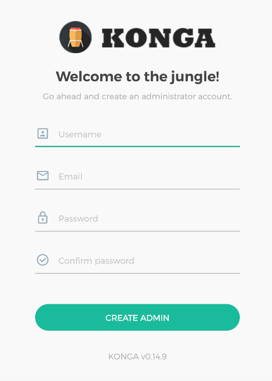

<small class="manual-caption">หน้าจอการใช้งานครั้งแรกของ KONGA</small>

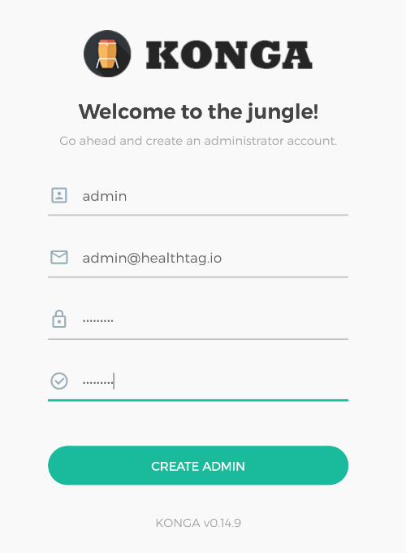

<small class="manual-caption">การกรอกข้อมูลเพื่อสร้างบัญชีของ Administrator</small>

ภายหลังการสร้างบัญชีของ Administrator เรียบร้อยแล้ว ระบบจะนำไปสู่หน้า Sign in
ให้กรอก Username และ Password ที่กำหนดในขั้นตอนก่อนหน้า จากนั้นเลือก Sign in


<small class="manual-caption">การ Sign in เข้าใช้งาน KONGA</small>


<small class="manual-caption">การกรอกข้อมูลเพื่อเข้าระบบ KONGA</small>

ระบบ KONGA จะให้ผู้ใช้งานกรอกข้อมูลเพื่อเชื่อมต่อกับ KONG API Gateway
โดยให้กรอกข้อมูลในการเชื่อมต่อ KONG โดยกำหนดชื่อ Connection และ KONG Admin URL
ดังนี้

- Name: KONG GATEWAY

- KONG Admin URL: [http://kong:8001](http://kong:8001)

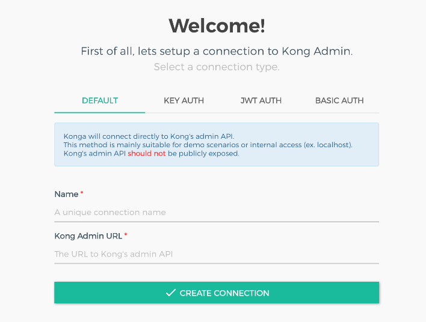

<small class="manual-caption">การกรอกข้อมูลเพื่อสร้าง Connection</small>

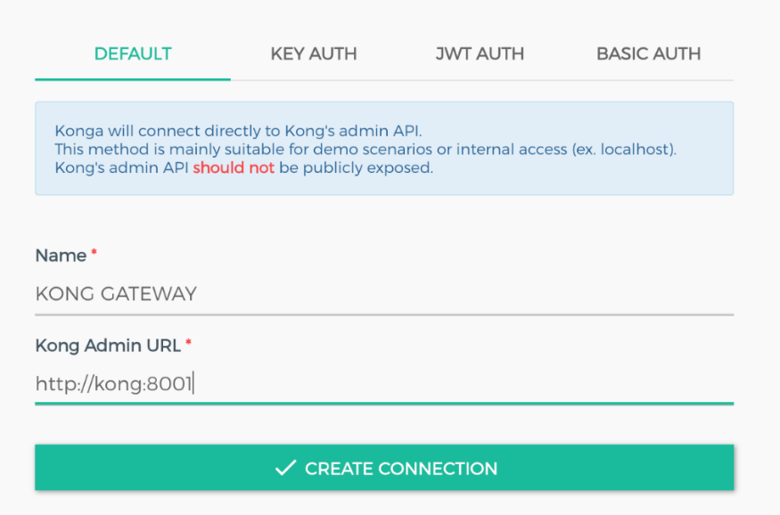

<small class="manual-caption">การกรอกข้อมูลเพื่อสร้าง KONG GATEWAY</small>

เมื่อติดตั้งสำเร็จ ระบบ KONGA จะแสดงผลดังรูป

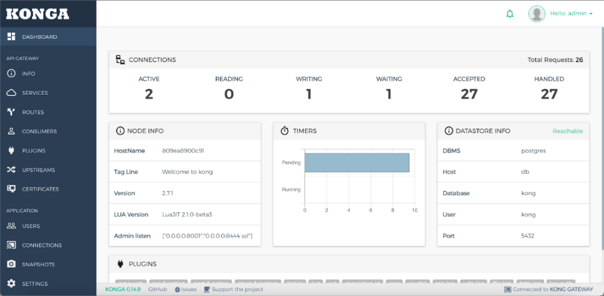

<small class="manual-caption">หน้าจอ Dashboard การใช้งาน KONGA</small>

### การสร้าง Service สำหรับทำ Proxy API สู่ FHIR API

สามารถข้ามขั้นตอนนี้ไปยัง 2.4 การสร้าง Consumer เพื่อใช้งาน KONG Administration
API เนื่องจากใน Docker Image ในขั้นตอน 1.2.3 มี Script
ที่ตั้งค่าขั้นตอนนี้ให้อัตโนมัติแล้ว
(ขั้นตอน 2.2 นี้ระบุไว้เพื่อให้เห็นการทำงานของ Script)

ภายใต้หัวข้อ Service เลือก Add New Service

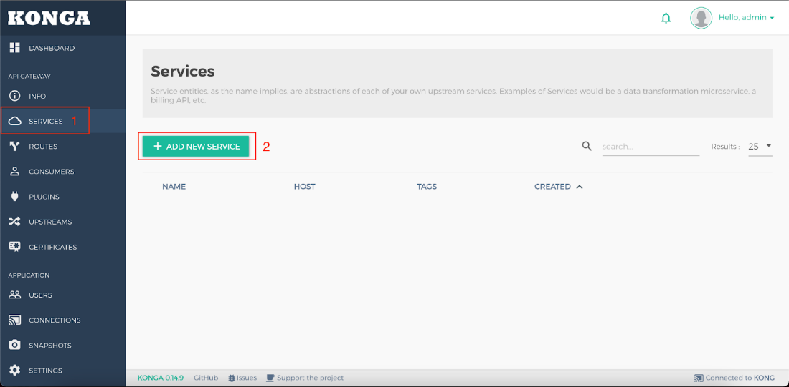

<small class="manual-caption">การสร้าง Service ใหม่</small>

ระบบจะแสดงหน้าต่าง Create Service ให้กรอกข้อมูลดังนี้

- Name: fhir-api

- Url: [http://hapi-fhir-jpaserver-start:8080/fhir](http://hapi-fhir-jpaserver-start:8080/fhir)

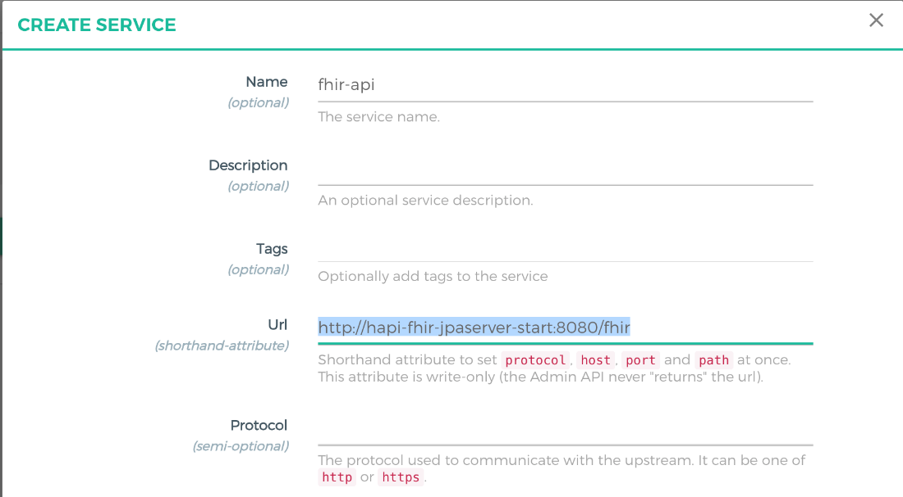

<small class="manual-caption">การกรอกข้อมูลเพื่อสร้าง Service fhir-api</small>

เมื่อสร้าง Service เรียบร้อยแล้ว ระบบจะแสดงชื่อ และรายละเอียดของ Service

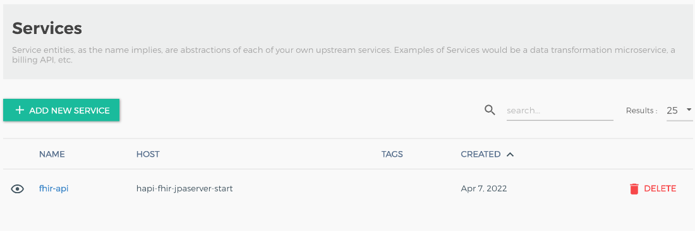

<small class="manual-caption">รายละเอียดของ fhir-api ที่มีการสร้างเรียบร้อยแล้ว</small>

เลือก Service fhir-api ที่ได้ทำการสร้างไว้ โดยระบบจะแสดงหน้าใหม่เพื่อใช้จัดการ
Service

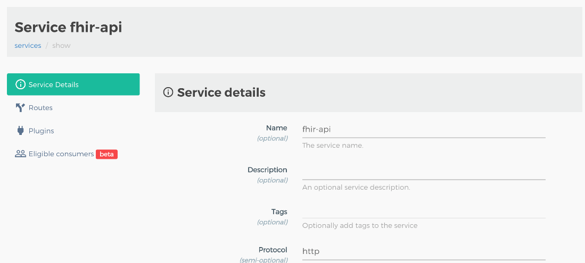

<small class="manual-caption">รายละเอียดของ Service fhir-api</small>

จัดการสร้างการเข้าถึง API โดยเลือกที่ Routes และ Add Route

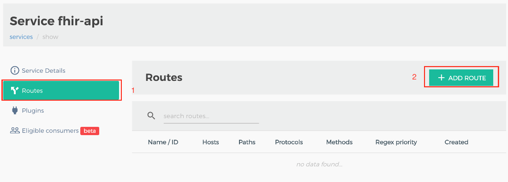

<small class="manual-caption">การสร้าง Route ให้กับ Service fhir-api</small>

กรอกข้อมูลของการสร้าง Route to FHIR API โดยการกรอกข้อมูลดังนี้

- Name: fhir-api

- Paths: /fhir-api (เมื่อพิมพ์เสร็จแล้วให้กด Enter)

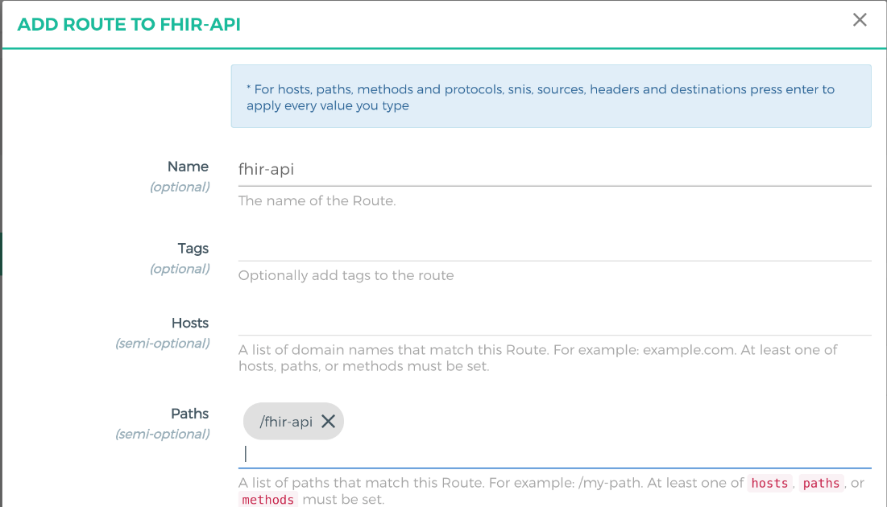

<small class="manual-caption">การเพิ่มข้อมูล Route ให้กับ fhir-api</small>

#### การเปิดใช้งานและตั้งค่า Plugins สำหรับ FHIR API เพื่อทำการเพิ่มความปลอดภัยของ API

เลือก Plugins จากนั้นกด Add Plugin

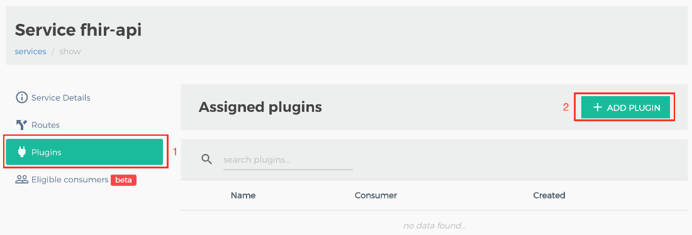

<small class="manual-caption">การเพิ่ม Plugin ให้กับ Service fhir-api</small>

**Basic Auth**

ภายใต้หมวด Authentication เลือก Basic Auth จากนั้นกด Add Plugin
(เพื่อใช้ในการเข้าถึงข้อมูลจาก User Interface ของโรงพยาบาลเพื่อดูข้อมูลยาในลำดับต่อไป)

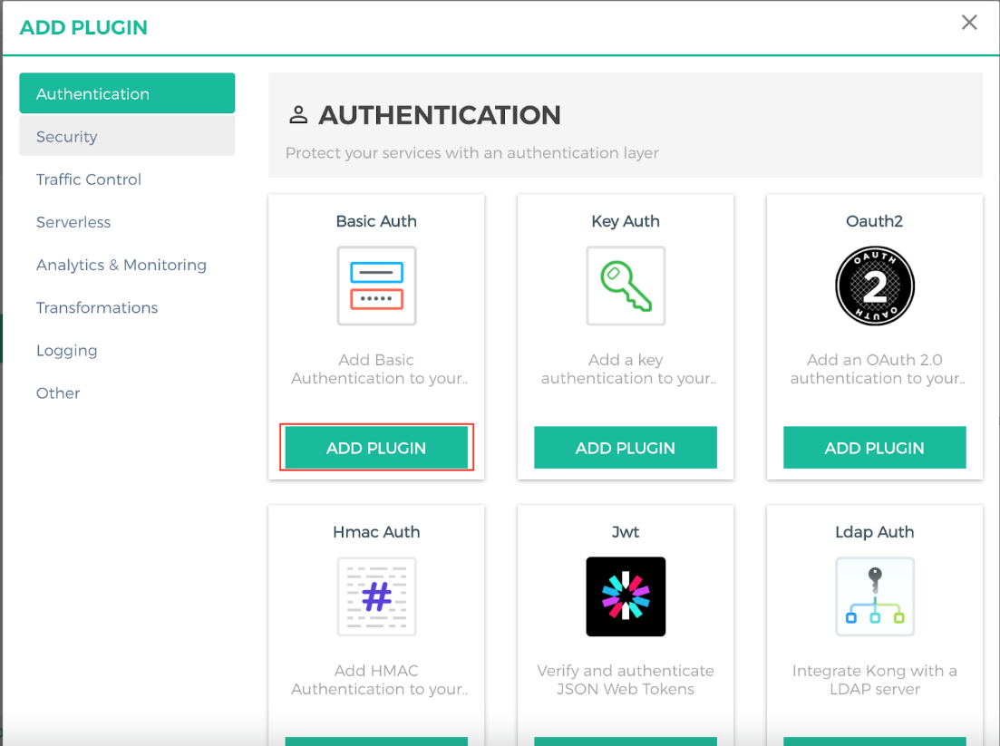

<small class="manual-caption">การเพิ่ม Basic Auth Plugin</small>

ระบบจะแสดงหน้าจอเพื่อให้กรอกข้อมูลเพื่อกำหนดค่า Plugin จากนั้นเลือก Add Plugin

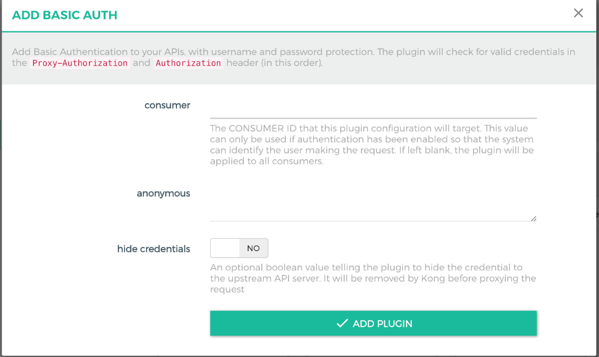

<small class="manual-caption">การกำหนดค่า Basic Auth Plugin</small>

**Cors**

ภายใต้หมวด Security เลือก Cors จากนั้นกด Add Plugin ซึ่ง Plugin
นี้จะใช้กำหนดการตั้งค่าของ Cross-Origin Resource Sharing เพื่อให้ Web browser
อนุญาตให้เว็บแอพพลิเคชั่น (ซึ่งอาจจะอยู่คนละ Domain กับ API นี้) สามารถเรียกใช้ API นี้ได้

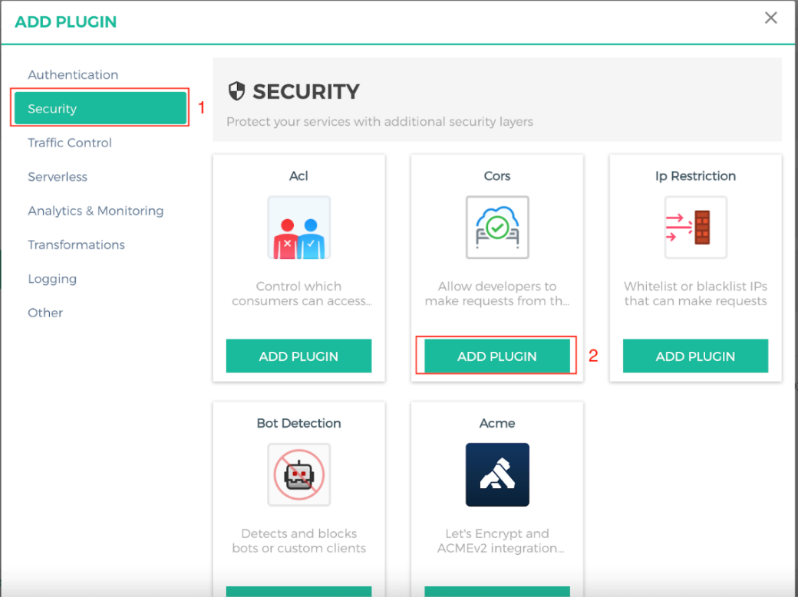

<small class="manual-caption">การเพิ่ม Cors Plugin</small>

ระบบจะแสดงหน้าจอเพื่อให้กรอกข้อมูลเพื่อกำหนดค่า Plugin โดยกำหนดค่าดังนี้ จากนั้นเลือก
Add Plugin เพื่อยืนยัน

- Origins: `*`

- Headers: `*`

- Exposed headers: `*`

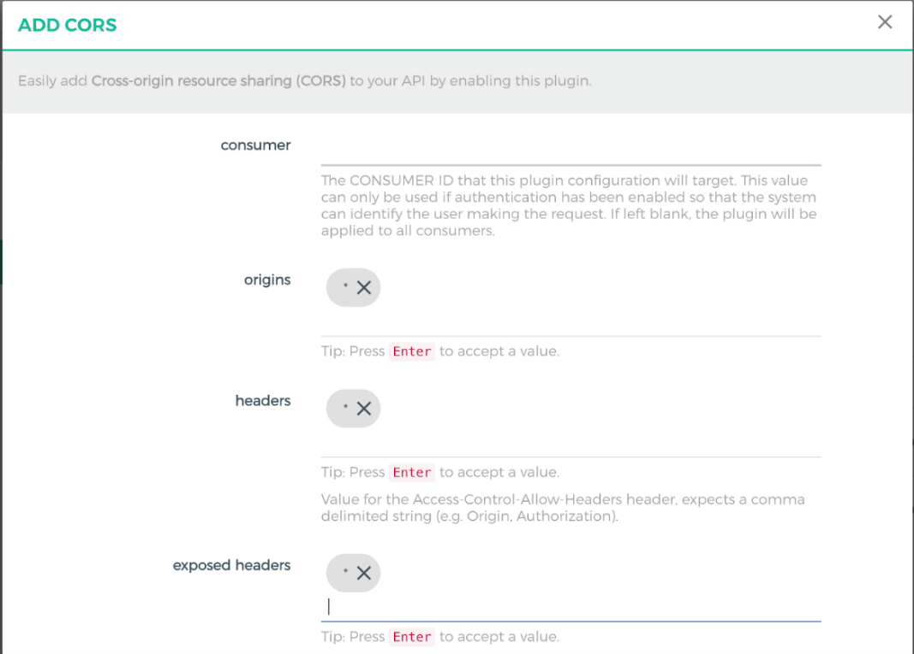

<small class="manual-caption">การกำหนดค่า Cors Plugin</small>

### การสร้าง Service สำหรับทำ Proxy API สำหรับ KONG Administration API

สามารถข้ามขั้นตอนนี้ไปยัง 2.4 การสร้าง Consumer เพื่อใช้งาน KONG Administration
API เนื่องจากใน Docker Image ในขั้นตอน 1.2.3 มี Script
ที่ตั้งค่าขั้นตอนนี้ให้อัตโนมัติแล้ว
(ขั้นตอน 2.3 นี้ระบุไว้เพื่อให้เห็นการทำงานของ Script)

ภายใต้หัวข้อ Service เลือก Add New Service


<small class="manual-caption">การสร้าง Service ใหม่</small>

ระบบจะแสดงหน้าต่าง Create Service ให้กรอกข้อมูลดังนี้

- Name: admin-api

- Url: [http://kong:8001](http://kong:8001)

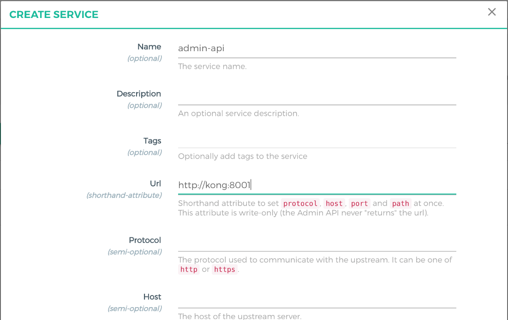

<small class="manual-caption">การกรอกข้อมูลเพื่อสร้างสร้าง Service admin-api</small>

หลังจากสร้างสำเร็จระบบจะแสดงรายละเอียด service

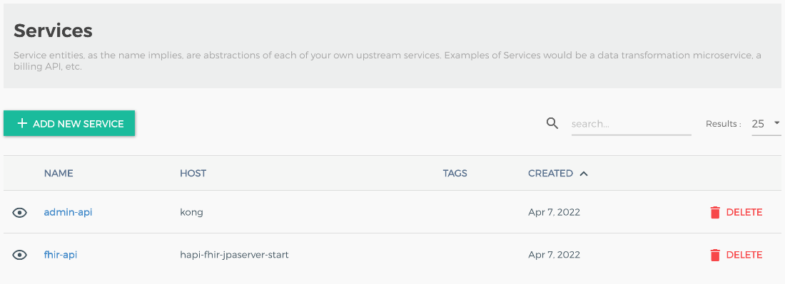

<small class="manual-caption">รายละเอียดของ Service admin-api ที่มีการสร้างเรียบร้อยแล้ว</small>

เลือก Service admin -api ที่ได้ทำการสร้างไว้ โดยระบบจะแสดงหน้าใหม่เพื่อใช้จัดการ
Service เพื่อเข้าไปจัดการเส้นทางการเข้าถึง

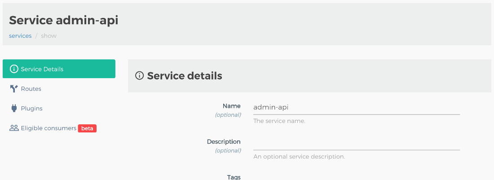

<small class="manual-caption">รายละเอียดของ Service admin-api</small>

จัดการสร้างการเข้าถึง API ด้วยการสร้าง Routes

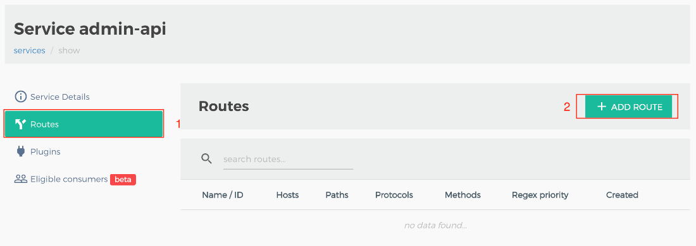

<small class="manual-caption">การสร้าง Route ให้กับ Service fhir-api</small>

การกรอกข้อมูลดังนี้

- Name: admin-api

- Paths: /admin-api (เมื่อพิมพ์เสร็จแล้วให้กด Enter)

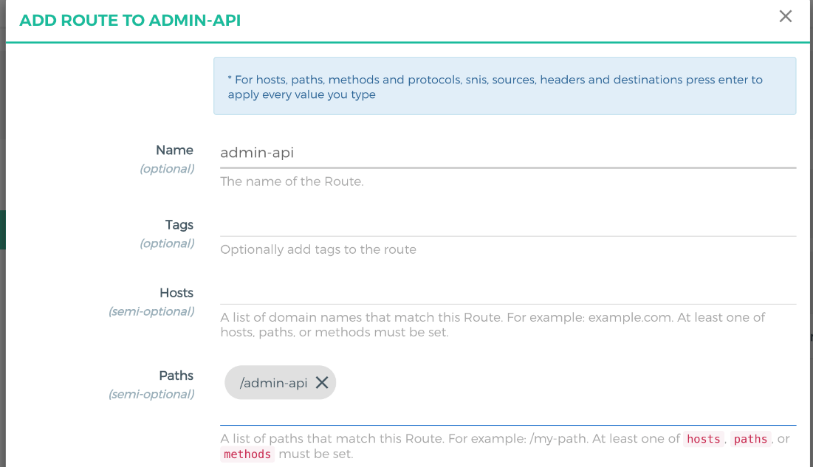

<small class="manual-caption">การเพิ่มข้อมูล Route ให้กับ admin-api</small>

#### เปิดใช้งานและตั้งค่า Plugins สำหรับ KONG Administration API เพื่อทำการเพิ่มความปลอดภัย

เลือก Plugins จากนั้นกด Add Plugin

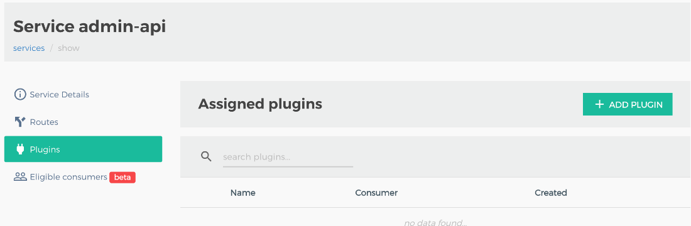

<small class="manual-caption">การเพิ่ม Plugin ให้กับ Service admin-api</small>

**Basic Auth**

ภายใต้หมวด Authentication เลือก Basic Auth จากนั้นกด Add Plugin ซึ่ง Plugin
นี้จะทำให้สามารถควบคุมการเข้าถึง Administration API ด้วย Username และ Password
ที่กำหนดไว้ได้ ซึ่ง Username และ Password นี้ใช้การเข้าสู่ User Interface
ของโรงพยาบาลที่ใช้เพิ่ม Username และ Password ให้กับผู้ป่วย


<small class="manual-caption">เพิ่ม Basic Auth Plugin</small>

กด Add Plugin เพื่อเพิ่ม Basic Auth


<small class="manual-caption">การกำหนดค่า Basic Auth Plugin</small>

**IP Restriction**

ภายใต้หมวด Security เลือก IP Restriction จากนั้นกด Add Plugin ซึ่ง Plugin
นี้ใช้จำกัดการเข้าถึงของ API โดยให้เข้าถึงได้จาก IP Address ที่กำหนดเท่านั้น

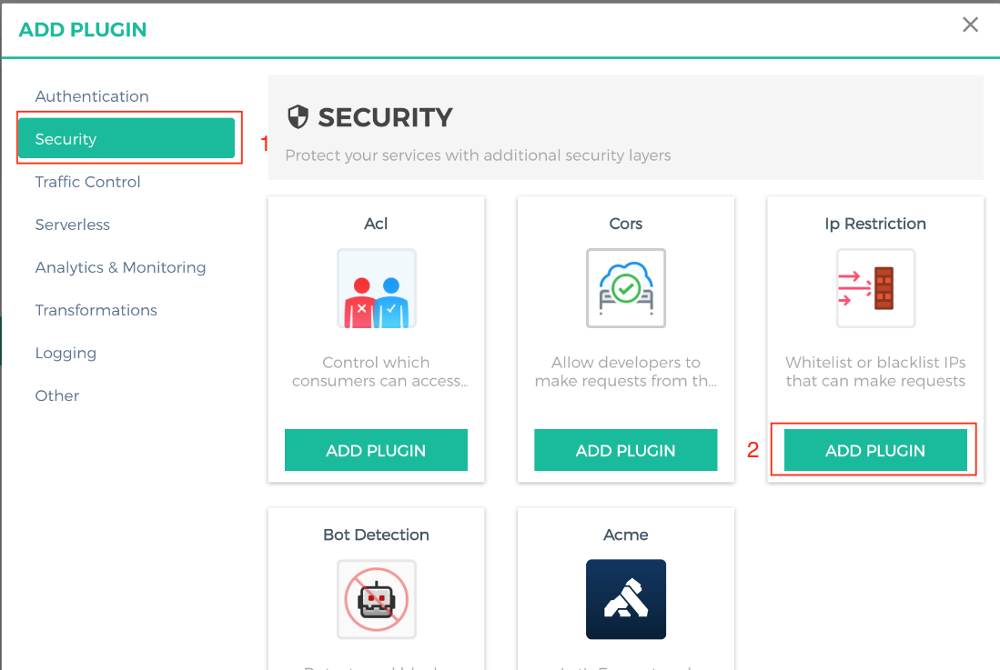

<small class="manual-caption">การเพิ่ม IP Restriction Plugin</small>

ใส่ค่า IP Intranet ของโรงพยาบาล (ที่ติดตั้ง Server ส่วนของ User Interface
ของโรงพยาบาลซึ่งจะเรียก Administration API นี้)

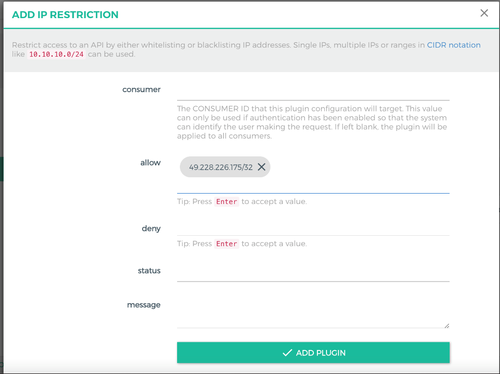

<small class="manual-caption">การกำหนดค่า IP Restriction Plugin</small>

**Cors**

การเปิดใช้และตั้งค่า Cors plugin ของ Administration API นี้
ตั้งค่าเหมือนกับการตั้งค่าของ FHIR API ตามหัวข้อ 2.2.1 การเปิดใช้งานและตั้งค่า Plugins
สำหรับ FHIR APIสร้าง User (Consumer) สำหรับ KONG Administration API

### การสร้าง Consumer เพื่อใช้งาน KONG Administration API

เลือกเมนู Consumers แล้วกด Create Consumer จากนั้นตั้งชื่อ Username ว่า admin-api

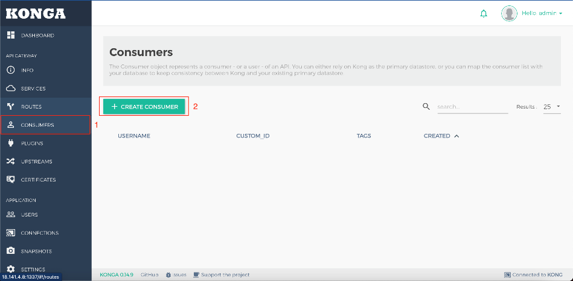

<small class="manual-caption">การสร้าง Consumers</small>

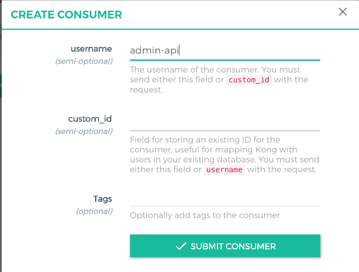

<small class="manual-caption">การสร้าง Consumers</small>

จากนั้นกด Submit Consumer เพื่อยืนยันการสร้างผู้ใช้

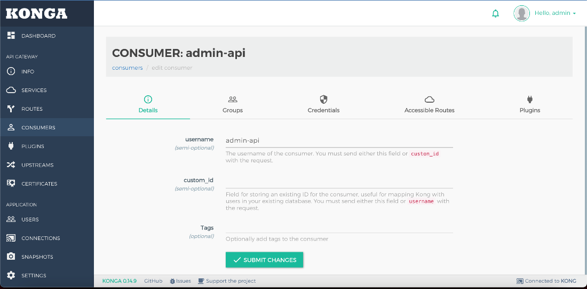

<small class="manual-caption">การยืนยันการสร้าง Consumers</small>

กำหนด Username และ Password สำหรับ admin-api user โดยเลือกหัวข้อ Credentials
แล้วเลือก Basic จากนั้นกด Create Credentials

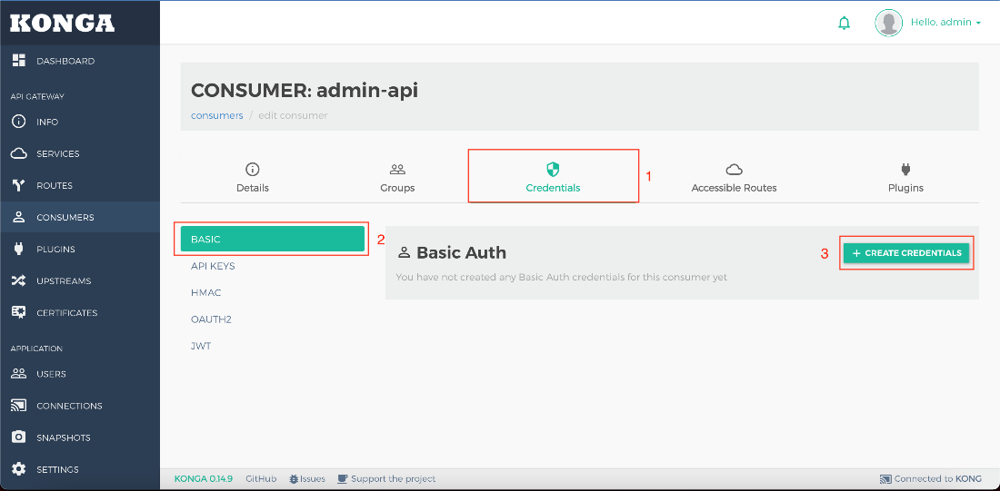

<small class="manual-caption">การกำหนดค่าสำหรับ Consumer admin-api</small>

กำหนด Username และ Password ที่ต้องการ

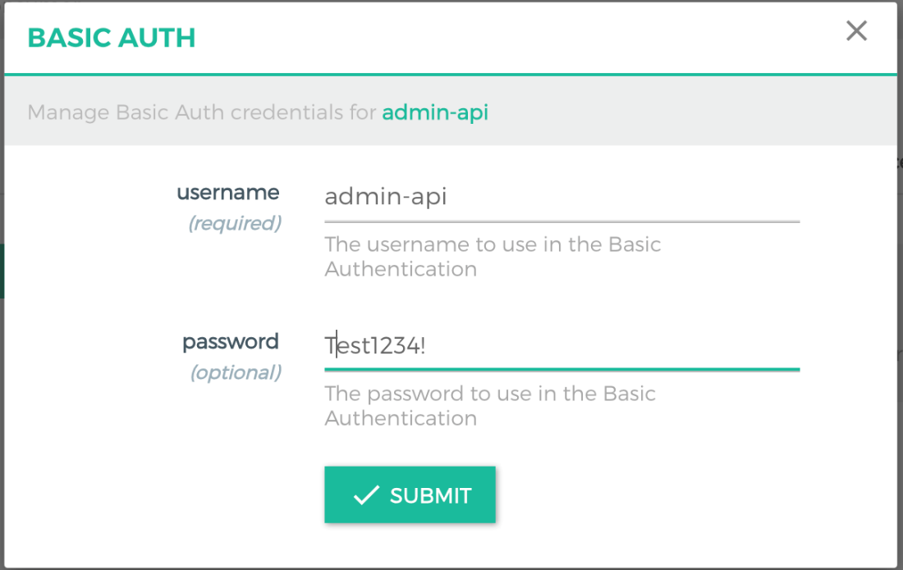

<small class="manual-caption">การตั้งค่า username password สำหรับ Basic Auth</small>

เลือก Submit เพื่อยืนยันการสร้าง Credential สำหรับผู้ใช้งานนี้

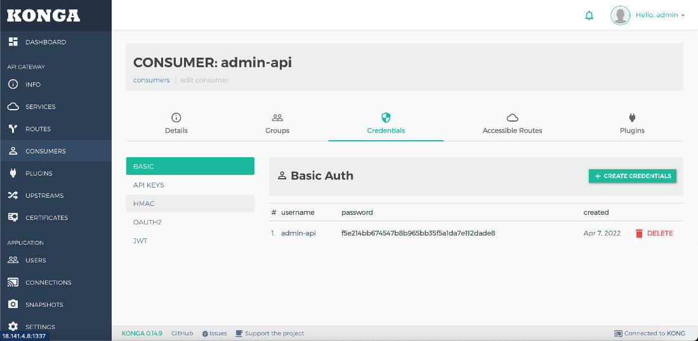

<small class="manual-caption">การยืนยันสร้าง credential</small>

## การดำเนินการกับไฟล์ CSOP

### การนำไฟล์ CSOP เข้าสู่ระบบผ่าน User Interface เพื่ออัพโหลดไฟล์

1.  เข้าสู่ http://ip_address:8888 ด้วย Username และ Password ที่ตั้งไว้

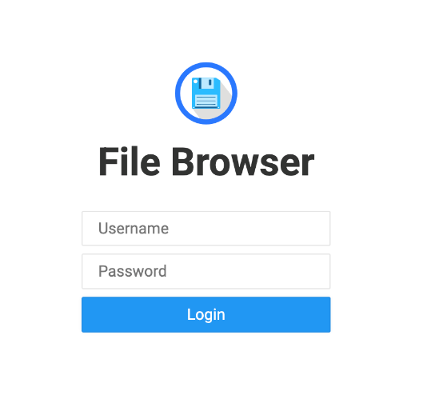

<small class="manual-caption">หน้าจอการ Login เข้าระบบ File browser</small>

2.  อัพโหลดไฟล์ CSOP โดยไฟล์ต้องมีโครงสร้างชื่อไฟล์ดังนี้
    - ไฟล์ CSOP ตั้งชื่อว่า `BILLTRAN<YYYYMMDD>.txt` สำหรับ CSOP ประเภท Bill Trans
    - ไฟล์ CSOP ตั้งชื่อว่า `BILLTDISP<YYYYMMDD>.txt` สำหรับ CSOP ประเภท Bill Disp

> **หมายเหตุ: การวางไฟล์ไม่สามารถใช้เป็น ZIP file ได้ จำเป็นจะต้องแตกไฟล์ .txt
> ที่อยู่ภายในและต้องตั้งชื่อไฟล์ให้เป็นไปตามที่ระบุไว้ข้างต้นเท่านั้น**

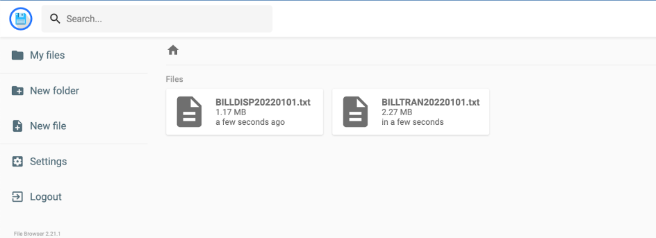

<small class="manual-caption">แสดงไฟล์ที่อับโหลดเรียบร้อยแล้ว</small>

### การใช้งาน Script แปลงข้อมูล CSOP เป็น FHIR

เจ้าหน้าที่ไอที จะต้องดำเนินการจัดเตรียม directory เพื่อให้รันสคริปต์ Python
ในการแปลงข้อมูลไฟล์รูปแบบ CSOP เป็นข้อมูลมาตรฐานตาม HL7 FHIR
เพื่อให้โปรแกรมอัพโหลดข้อมูลที่ได้เข้าระบบ HAPI FHIR Server ต่อไป

**สิ่งที่จำเป็นต้องมี**

1.  ระบบ HAPI FHIR Server ที่ใช้โครงสร้างมาตรฐานข้อมูลแบบ HL7 FHIR (IP address
    หรือ domain name)

2.  เครื่องคอมพิวเตอร์ที่มี Python version 3.8 ขึ้นไป และ Library `xmltodict`

```bash
pip3 install xmltodict
```

**ขั้นตอนการใช้งาน Script**

1.  นำ Script ไปอยู่ในโฟลเดอร์ไว้ที่ Root โฟลเดอร์

2.  ใน Root โฟลเดอร์ สร้างโฟลเดอร์ uploads เพื่อใช้สำหรับการเก็บไฟล์ CSOP

    - ไฟล์ CSOP ตั้งชื่อว่า `BILLTRAN<YYYYMMDD>.txt` สำหรับ CSOP ประเภท Bill
      Trans

    - ไฟล์ CSOP ตั้งชื่อว่า `BILLTDISP<YYYYMMDD>.txt` สำหรับ CSOP ประเภท Bill
      Disp

3.  นำไฟล์ในข้อ 5.3,5.4 วางในโฟลเดอร์ uploads

4.  ปรับเปลี่ยนการตั้งค่าใน Script โดย

        - กรณีรันจากเครื่องคอมพิวเตอร์ข้างนอก ที่ไม่ใช่ FHIR เซิร์ฟเวอร์ ให้แก้ค่า
          base_fhir_url ใน script เป็น IP Address หรือ domain เพื่อส่งข้อมูลไปถึง
          FHIR เซิร์ฟเวอร์ รวมถึงการใส่ค่าต่างๆเพื่อให้ผ่านระบบความปลอดภัยที่ติดตั้งไว้

        - กรณีรันจากเครื่องเซิร์ฟเวอร์ที่ติดตั้ง HAPI FHIR Server แล้ว ให้ใช้ internal URL

```python
base_fhir_url = "http://hapi-fhir-jpaserver-start:8080/fhir"
```

    (อ้างอิง [https://github.com/health-tag/hospital-fhir-node](https://github.com/health-tag/hospital-fhir-node))

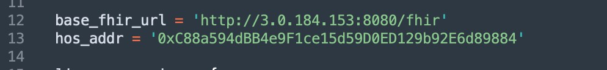

<small class="manual-caption">แสดงการตั้งค่า Script</small>

5. รัน script

```bash
python3 transform_fhir.py
```

    โดยเจ้าหน้าที่ไอทีจะต้องมาดำเนินการรันไฟล์ดังกล่าวทุกวัน
    ทั้งนี้สามารถตั้งค่าให้โปรแกรมรันโดยอัตโนมัติด้วยวิธี Cron job

6.  ตรวจสอบข้อมูลที่เข้าสู่ระบบหลังจาก script ทำงานเสร็จสิ้น

## วิธีการใช้งาน Web application

### การสร้าง Username และ Password ให้กับผู้ป่วยสำหรับเจ้าหน้าที่โรงพยาบาล (Admin)

1.  เข้าสู่ระบบ User Interface ด้วย [http://ip_address/admin](http://ip_address/admin)

2.  กรอก Username และ Password สำหรับผู้ดูแลระบบ ที่ตั้งในข้อก่อนหน้า แล้วเข้าสู่ระบบ

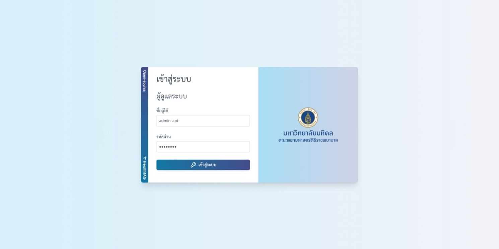

<small class="manual-caption">หน้าจอเพื่อเข้าสู่ระบบ</small>

3.  ระบบจะแสดงหน้าจอศูนย์จัดการระบบ ในเลือก ลงทะเบียนผู้รับบริการ

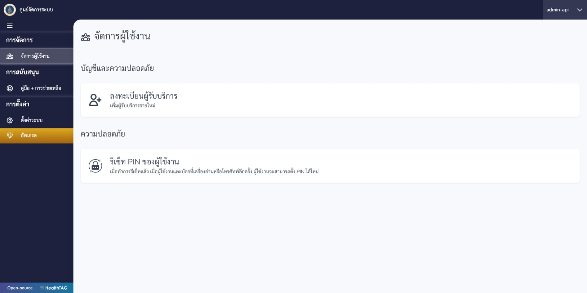

<small class="manual-caption">หน้าจอศูนย์จัดการระบบ</small>

4.  ระบบจะแสดงหน้าจอลงทะเบียนผู้รับบริการ สำหรับการสร้างชื่อผู้ใช้งาน (Username)
    และรหัสผ่าน (Password) ให้กับผู้ป่วย

5.  ให้ผู้ดูแลระบบกรอกหมายเลขประจำตัวผู้ป่วย (Hospital Number: HN) ซึ่งจะเป็น
    Username ให้ผู้ป่วย จากนั้นให้ผู้ป่วยกำหนดรหัสผ่านด้วยตัวเองเป็นตัวเลขทั้งหมด 6 หลัก

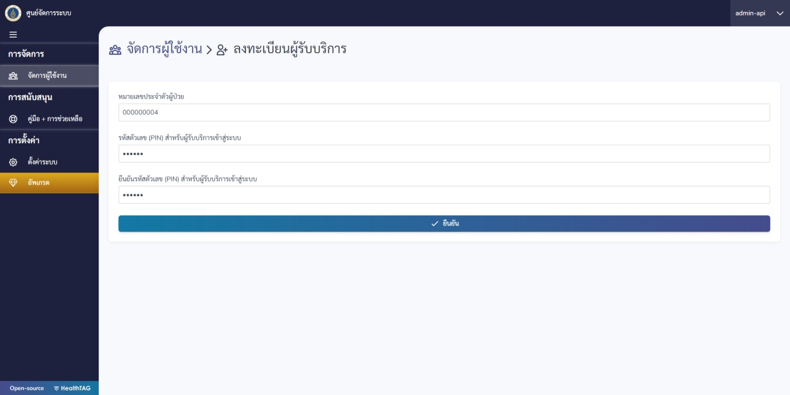

<small class="manual-caption">หน้าจอลงทะเบียนผู้รับบริการ และการกำหนดชื่อผู้ใช้งานแลรหัสผ่านของผู้ป่วย</small>

6.  กดยืนยันการสร้าง User ให้ผู้ป่วย เพื่อใช้ในการดูข้อมูลยาผ่านระบบ User Interface

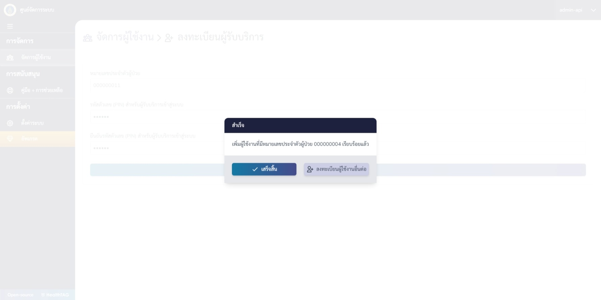

<small class="manual-caption">หน้าจอแสดงการลงทะเบียนสำเร็จ</small>

### การดูข้อมูลยาผ่าน Username และ Password สำหรับผู้ป่วย

1.  เข้าสู่ระบบ User Interface ด้วย [http://ip_address](http://ip_address)

2.  กรอก Username และ Password
    ของผู้ป่วยที่ได้ทำการสมัครผ่านเจ้าหน้าที่โรงพยาบาลในขั้นตอนก่อนหน้า

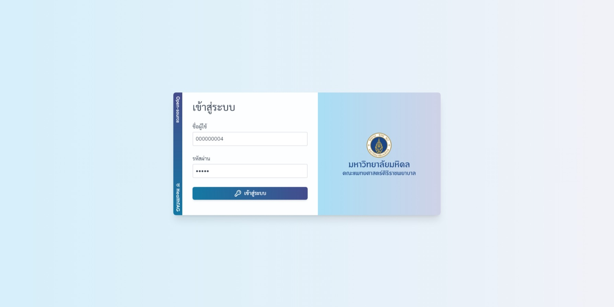

<small class="manual-caption">การกรอกรหัสของผู้ป่วยสำหรับดูข้อมูลยา</small>

3.  ระบบจะแสดงหน้าข้อมูลสุขภาพ โดยที่หัวข้อยาจะแสดงข้อมูลยาที่ผู้ป่วยได้รับ
    โดยอ้างอิงฐานข้อมูลซึ่งจัดเก็บข้อมูลในรูปแบบ HL7 FHIR

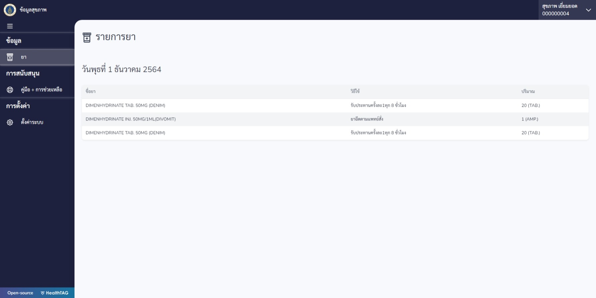

<small class="manual-caption">การดูข้อมูลยาของผู้ป่วย</small>
